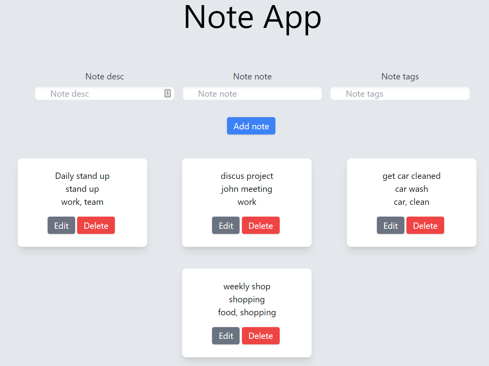
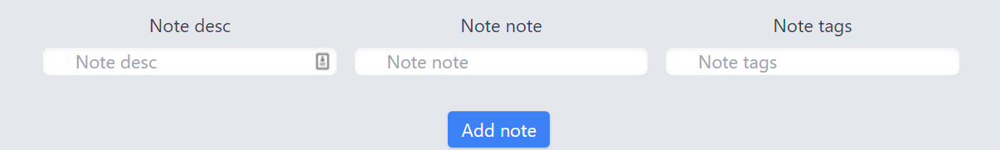
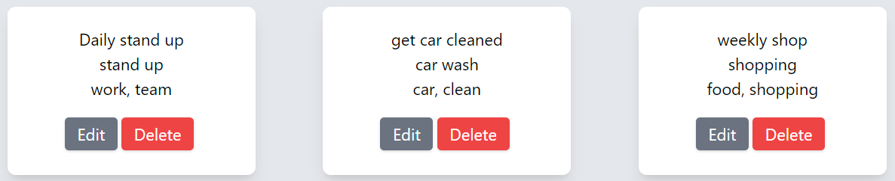
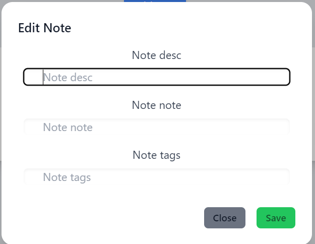

# Note app useContext

The aim for this project was to create a note taking app that saves data to IndexDB on the users machine so they can come back to the app and the data will persist. React useContext was used for state. 
Tailwind was used for the CSS and headless UI as a component library.
Jest and Cypress were used for testing
<br />


## Technologies
* React 18.2.0
* tailwindcss 3.1.8
* headlessui/react 1.7.2
* idb-keyval 6.2.0
* Cypress 10.4.0
* testing-library/react 13.4.0

<br />
<br />
## Installation
First, run the development server:

```bash
npm run dev
# or
yarn dev
```

Open [http://localhost:3000](http://localhost:3000) with your browser to see the result.

The page will reload when you make changes.\
You may also see any lint errors in the console.
<br />
<br />

## Usage

To add a note you have 3 input boxes. one for the note description, note name and tags. After filling out the form click the "Add note" button
<br />

<br />
<br />
The added note will show in the list view below
<br />

<br />
<br />
You can edit a note by click the "Edit" button in the list view. A modal will open. you can change the description, note and the tags. you can save your change or close the modal without saving. 
<br />



